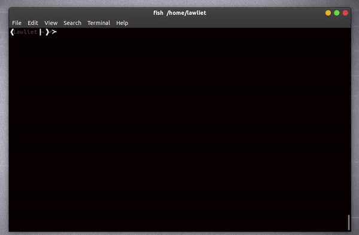

</img>
---
<p align = 'center'>
    </img>
</p>
---
# About SIP
☕️ **`sip`** is a terminal assistant to <span style = 'color:red'>`S`</span>earch and <span style = 'color:red'>`I`</span>nstall npm <span style = 'color:red'>`P`</span>ackages.

# Installation
## Using [npm]('#')
### `Install` globally.
``` bash
npm install -g sip
```
# Usage
``` bashS
$ sip
```


# Features
* 🕵‍♀️️ **Search npm packages** : Search npm packages fast and efficiently using npms search [api]('https://api-docs.npms.io/').
<br><br>
* 👩‍👧‍👧️ **Install multiple packages** : Easily search and install multiple npm packages with one click.
<br><br>
* 👶️ **Easy to use** : Easy to use. ( made by a noob for other noobs ). 
<br><br>
* 🌌️ **Interactive** : Interactive cli.

## Note 😇️
You guys can do whatever you want to do with this code. I won't mind. 😁️

---